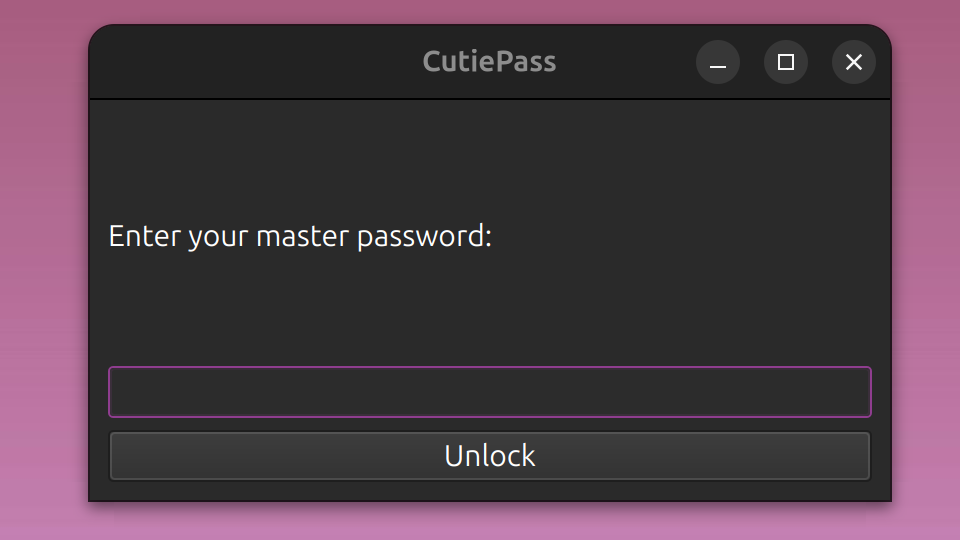
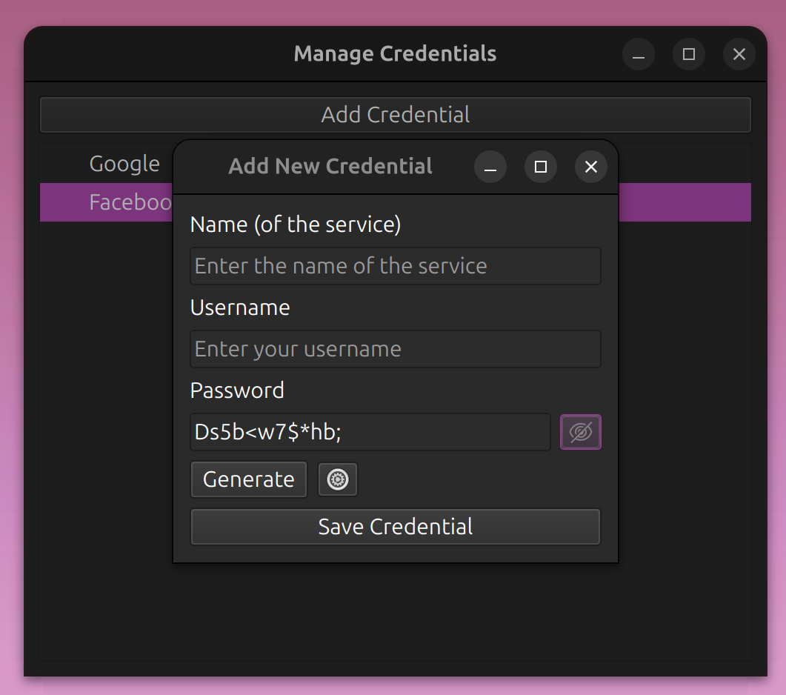
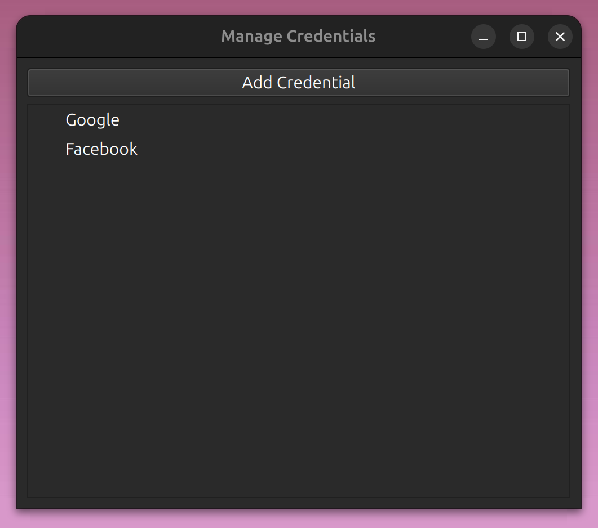
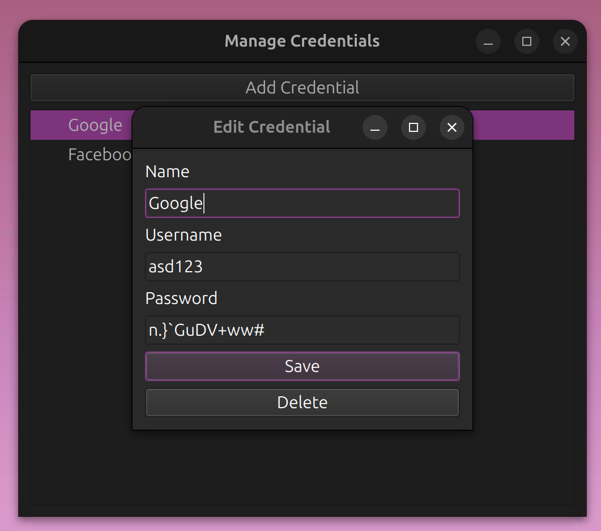
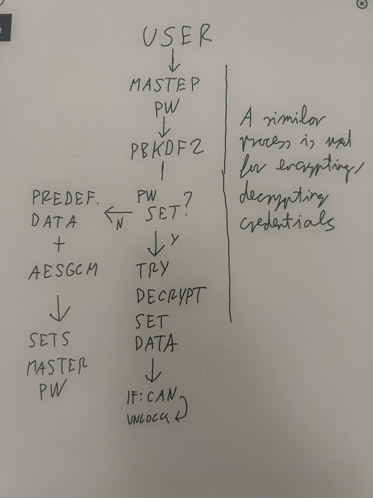

# Introduction

CutiePass is a local password manager created using Python, PyQt 6 and SQLite. It helps the user keep track of credentials locally on a device. It uses a master password to unlock the vault in which the credentials are stored. A mechanism to generate a password is also implemented.

# Setup 

## Prerequisites

- Python 3.12 or higher

## Installation

1. Clone the repository
2. Install the dependencies using the following command (from requirements.txt)
```bash
pip install -r requirements.txt
```

## Running the application

To run the application, execute the following command:
```bash
python main.py
```

# Screenshots

## Unlocking the vault


## Adding a credential


## Viewing credentials


## Editing a credential


# Security Model

Security considerations are taken into account to ensure that the user's credentials are stored securely and are not easily accessible to unauthorized users. 
This extends to an actor having access to the database file, the user's device, or the running application (to some extent, see: Pitfalls).

## Master Password

Upon the first start, the user asked to provide a master password. 

* The master password is a common mechanism to unlock the vault in password managers. It is specific to the user and thus can safely authenticate the user to access the vault. *

From this master password a key is derived via PBKDF2 to encrypt a predefined data ([timestamp]::verification), via AESGCM to save whether a master password has been set already for the application. 

* The key derivation function ensures that the key is not easily brute-forced. The timestamp is joined to the known data to ensure that the hash is unique and cannot be computed backwards. *

Each time the user would like to unlock the vault, they have to provide their master password. The data in the settings table is then attempted to be decrypted with the password. If the password is right, then the data can be decrypted and the vault unlocks.

* The master password is not stored in the database. The key is derived from the master password and used to encrypt the data. This is the key only lives in the user's head. AESGCM is used to check whether the master password is correct (meaning the key is correct), which can be concluded if the data can be decrypted. *

## Managing credentials

The user can add credentials to the vault via clicking the "Add Credential" button.
The credentials are encrypted using the master password as a key. 
* This binds the credentials to the user and ensures that only the user can access the credentials. *
The credentials are stored in the database in an encrypted form. 
* This ensures that the credentials are not stored in plain text and are not easily accessible to unauthorized users. *
Each credential and its corresponding data are encrypted and salted separately and uniquely. 
* This ensures that each credential is encrypted with a unique key and salt, making it harder for an attacker to decrypt the credentials. *
The user may generate a password for a credential with a cryptographically secure random generator.
* This ensures that the generated password is secure and not easily guessable, nor it can be regenerated. *
The user may modify the character set, length, and whether to include special characters in the generated password but is provided with a safe default.
* This allows the user to customize the generated password to their needs if needed, but provides safety out of the box. *

The data is decrypted when the user wants to view the credentials. (The name of the credential is stored in plain text, as it is not deemed as sensitive information.)
* Credentials are decrypted on the fly when the user wants to view them to add an extra layer of security and enhance the user experience (save time upon unlocking). *

# Pitfalls

- Upon setting the master password, the user is not asked to confirm the password. This may lead to the user setting a password that they did not intend to.
- The master password is stored in the running application's memory in plain text. This is a security risk as it can be accessed by other applications.
- The user has unlimited attempts to enter the master password. This may lead to brute force attacks.
- There is no mechanism to recover the master password if the user forgets it. This may lead to the user losing access to their credentials.

# Diagram 

